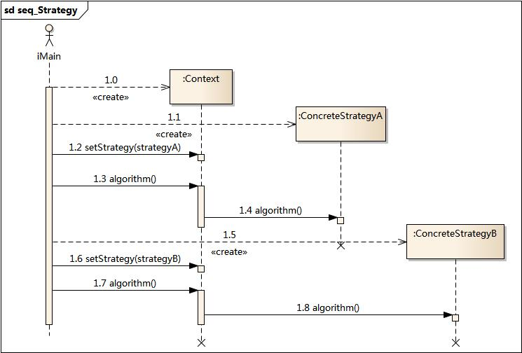

## 行为型模式
### 策略模式

**1、模式定义**：

策略模式(Strategy Pattern)：定义一系列算法，将每一个算法封装起来，并让它们可以相互替换。策略模式让算法独立于使用它的客户而变化，也称为政策模式(Policy)。

策略模式包含如下角色:

**Context**：调用类，负责调用已有的策略实例。

**Strategy**：抽象策略类，为具体的策略实现类定义策略接口。

**ConcreteStrategy**：具体策略类，根据不同的策略实现的具体策略类。

模式结构：

时序图：

**2、适用场景**：  

- 1、如果在一个系统里面有许多类，它们之间的区别仅在于它们的行为，那么使用策略模式可以动态地让一个对象在许多行为中选择一种行为。
- 2、一个系统需要动态地在几种算法中选择一种。
- 3、如果一个对象有很多的行为，如果不用恰当的模式，这些行为就只好使用多重的条件选择语句来实现。
- 4、不希望客户端知道复杂的、与算法相关的数据结构，在具体策略类中封装算法和相关的数据结构，提高算法的保密性与安全性。

**3、模式总结**：  

当增加新的策略时，只需要增加具体的新具体策略，并修改客户端的代码。策略模式与简单工厂模式结合，就可以将客户端的逻辑判断转移到策略调用类，从而使客户端的代码更简洁，后续的扩展，客户端的修改就可以尽可能的少。

优点：
- 策略模式提供了对“开闭原则”的完美支持，用户可以在不修改原有系统的基础上选择算法或行为，也可以灵活地增加新的算法或行为。
- 策略模式提供了管理相关的算法族的办法。
- 策略模式提供了可以替换继承关系的办法。
- 使用策略模式可以避免使用多重条件转移语句。

缺点：
- 客户端必须知道所有的策略类，并自行决定使用哪一个策略类。
- 策略模式将造成产生很多策略类，可以通过使用享元模式在一定程度上减少对象的数量。